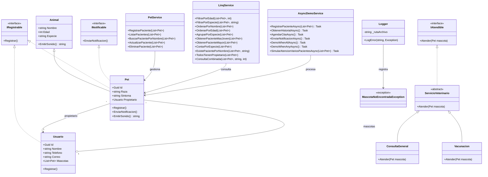

# 🐾 VetCare RM

Sistema de gestión para una clínica veterinaria desarrollado en **C# 14 / .NET 10**.

VetCare RM es una aplicación de consola para gestionar pacientes y propietarios, incorporando **CRUD, programación orientada a objetos, herencia, polimorfismo, interfaces, LINQ, programación asíncrona, manejo de excepciones, logging y pruebas automatizadas con xUnit**.

> **Estado:** funcionalidades principales implementadas y verificadas mediante `dotnet build` y `dotnet test`.

---

## 📋 Índice

- [Descripción](#-descripción)
- [Objetivo](#-objetivo)
- [Tecnologías](#-tecnologías)
- [Funcionalidades](#-funcionalidades)
- [Menú principal](#-menú-principal)
- [CRUD de pacientes](#-crud-de-pacientes)
- [Programación orientada a objetos](#-programación-orientada-a-objetos)
- [Interfaces](#-interfaces)
- [LINQ](#-linq)
- [Programación asíncrona](#-programación-asíncrona)
- [Manejo de errores y logging](#-manejo-de-errores-y-logging)
- [Pruebas automatizadas](#-pruebas-automatizadas)
- [Estructura del proyecto](#-estructura-del-proyecto)
- [Diagrama UML](#-diagrama-uml)
- [Flujo de la aplicación](#-flujo-de-la-aplicación)
- [Convenciones de código](#-convenciones-de-código)
- [Requisitos](#-requisitos)
- [Instalación y ejecución](#-instalación-y-ejecución)
- [Comandos útiles](#-comandos-útiles)
- [Estado del proyecto](#-estado-del-proyecto)

---

## 📖 Descripción

VetCare RM es una aplicación de consola orientada a la gestión básica de una clínica veterinaria.

La aplicación permite registrar mascotas como pacientes y asociarlas con sus propietarios. Los pacientes pueden ser consultados, actualizados y eliminados mediante un identificador `Guid`.

El proyecto integra diferentes conceptos de C# trabajados durante las historias de usuario:

- Clases y objetos.
- Encapsulación mediante propiedades.
- Herencia.
- Polimorfismo.
- Clases abstractas.
- Interfaces.
- Colecciones `List<T>` y `Dictionary<TKey,TValue>`.
- LINQ.
- Excepciones personalizadas.
- Programación asíncrona.
- `Task`, `Task.Run`, `Task.WhenAll` y `Task.WhenAny`.
- Pruebas automatizadas.
- Registro de errores.
- Organización mediante modelos, servicios, interfaces y excepciones.

La información de los pacientes se mantiene actualmente en una colección en memoria durante la ejecución de la aplicación.

---

## 🎯 Objetivo

El objetivo del proyecto es construir progresivamente un sistema veterinario aplicando buenas prácticas de desarrollo en C#.

Los principales objetivos técnicos son:

1. Crear modelos representativos del dominio veterinario.
2. Implementar operaciones CRUD.
3. Separar lógica mediante servicios.
4. Aplicar programación orientada a objetos.
5. Utilizar interfaces y polimorfismo.
6. Utilizar LINQ para consultar colecciones.
7. Implementar operaciones asíncronas.
8. Manejar errores mediante excepciones.
9. Registrar errores en archivos de log.
10. Crear pruebas automatizadas.
11. Mantener convenciones de codificación claras y uniformes.
12. Documentar las relaciones principales mediante UML.

---

# 🛠️ Tecnologías

| Tecnología | Uso |
|---|---|
| C# 14 | Lenguaje principal |
| .NET 10 | Framework de ejecución |
| .NET Console | Interfaz actual |
| LINQ | Consultas y operaciones sobre colecciones |
| `async` / `await` | Programación asíncrona |
| `Task` | Ejecución y coordinación de tareas |
| xUnit | Pruebas automatizadas |
| Git | Control de versiones |
| Mermaid | Diagrama UML |

---

# ⚙️ Funcionalidades

Actualmente el sistema cuenta con:

### Gestión de pacientes

- Registrar paciente.
- Listar pacientes.
- Buscar paciente por nombre.
- Actualizar paciente.
- Eliminar paciente.

### Consultas

El sistema permite:

- Filtrar pacientes por edad.
- Filtrar pacientes por especie.
- Ordenar por nombre.
- Ordenar por edad.
- Agrupar por especie.
- Obtener el paciente más joven.
- Obtener el paciente de mayor edad.
- Contar mascotas por especie.
- Comprobar si existe un paciente por nombre.
- Comprobar que todos los pacientes tengan propietario.
- Ejecutar una consulta combinada por especie y edad mínima.

### Programación orientada a objetos

- `Animal` como clase base.
- `Pet` como clase derivada.
- `ServicioVeterinario` como clase abstracta.
- `ConsultaGeneral` y `Vacunacion` como servicios derivados.
- Interfaces `IRegistrable`, `IAtendible` e `INotificable`.

### Programación asíncrona

- Registro asíncrono de pacientes.
- Ejecución de varias tareas.
- `Task.WhenAll`.
- `Task.WhenAny`.
- `Task.Run`.
- Simulación de atención concurrente de varios pacientes.

### Manejo de errores

- Validación de entradas.
- `MascotaNoEncontradaException`.
- `Logger`.
- Archivo `logs/errors.log`.

### Pruebas

Se utilizan pruebas automatizadas con xUnit para comprobar:

- Registro asíncrono.
- Ejecución de tareas asíncronas.
- Herencia.
- Polimorfismo.
- Interfaces.
- Relación entre propietarios y mascotas.
- Servicios veterinarios.

---

# 🖥️ Menú principal

El menú está organizado por funcionalidades del sistema:

```text
======================================
 Clínica Veterinaria VetCare RM
======================================

GESTIÓN DE PACIENTES

1. Registrar paciente
2. Listar pacientes
3. Buscar paciente por nombre
4. Actualizar paciente
5. Eliminar paciente

CONSULTAS

6. Consultar pacientes
7. Operaciones de atención

8. Salir
```

Los conceptos técnicos como LINQ y programación asíncrona se utilizan internamente para implementar las funcionalidades y no se presentan como nombres técnicos en el menú principal.

Las operaciones internas cuentan con opciones para regresar al menú cuando corresponde.

---

# 🐶 CRUD de pacientes

## 1. Registrar paciente

El sistema solicita los datos del propietario:

- Nombre.
- Teléfono.
- Correo.

Después solicita los datos del paciente:

- Nombre.
- Edad.
- Especie.
- Raza.
- Síntoma.

Cada paciente recibe automáticamente un identificador `Guid`.

La información se agrega a:

```csharp
List<Pet> pacientes
```

---

## 2. Listar pacientes

Muestra todos los pacientes registrados junto con:

- ID.
- Nombre.
- Edad.
- Especie.
- Raza.
- Síntoma.
- Datos del propietario.

Si no existen pacientes:

```text
No hay pacientes registrados.
```

---

## 3. Buscar paciente

La búsqueda se realiza por nombre y no distingue entre mayúsculas y minúsculas.

Ejemplo:

```csharp
pacientes.FirstOrDefault(
    p => p.Nombre.Equals(
        nombreBuscado,
        StringComparison.OrdinalIgnoreCase
    )
);
```

Si no existen pacientes, el sistema informa la situación antes de solicitar la búsqueda.

---

## 4. Actualizar paciente

La actualización se realiza mediante el `Guid`.

El proceso es:

1. Mostrar pacientes disponibles.
2. Solicitar el ID.
3. Buscar el paciente.
4. Mostrar los datos actuales.
5. Solicitar nuevos datos.
6. Actualizar la información.

También se puede escribir `0` para volver sin realizar la operación.

---

## 5. Eliminar paciente

La eliminación utiliza el `Guid`.

Antes de eliminar:

1. Se muestra el paciente seleccionado.
2. Se solicita confirmación.
3. Solo si el usuario responde `S`, se elimina.

Ejemplo:

```text
¿Desea eliminar este paciente? (S/N):
```

Esto evita eliminaciones accidentales.

---

# 🧱 Programación orientada a objetos

## Animal

`Animal` es la clase base para representar un animal genérico.

Contiene:

```text
Nombre
Edad
Especie
```

También define:

```csharp
public virtual string EmitirSonido()
```

---

## Pet

`Pet` representa una mascota/paciente.

Hereda de `Animal`:

```csharp
public class Pet : Animal
```

Además implementa:

```text
IRegistrable
INotificable
```

Sus propiedades específicas son:

```text
Id
Raza
Sintoma
Propietario
```

---

## Herencia

La relación principal es:

```text
Animal
   ▲
   │
  Pet
```

`Pet` reutiliza propiedades y comportamiento de `Animal`.

---

## Polimorfismo

`Pet` sobrescribe:

```csharp
public override string EmitirSonido()
```

El resultado depende de la especie:

```text
Perro   → Guau
Gato    → Miau
Otra    → Sonido genérico
```

---

## Servicios veterinarios

`ServicioVeterinario` es una clase abstracta:

```csharp
public abstract class ServicioVeterinario : IAtendible
{
    public abstract void Atender(Pet mascota);
}
```

De ella derivan:

- `ConsultaGeneral`.
- `Vacunacion`.

Cada servicio proporciona su propia implementación de `Atender`.

---

# 🔌 Interfaces

El proyecto utiliza interfaces para definir comportamientos.

## IRegistrable

Define:

```csharp
void Registrar();
```

Implementada por:

- `Pet`.
- `Usuario`.

## IAtendible

Define:

```csharp
void Atender(Pet mascota);
```

Implementada por los servicios veterinarios.

## INotificable

Define:

```csharp
void EnviarNotificacion();
```

Implementada por `Pet`.

---

# 🔎 LINQ

Las consultas están encapsuladas en:

```text
VetCareRm.Consola/Services/LinqService.cs
```

Se utilizan:

- `Where`
- `OrderBy`
- `OrderByDescending`
- `GroupBy`
- `ToDictionary`
- `FirstOrDefault`
- `Any`
- `All`
- `Count`
- `ToList`

### Filtrado

```csharp
return pacientes
    .Where(paciente => paciente.Edad == edad)
    .ToList();
```

### Agrupación

```csharp
return pacientes
    .GroupBy(paciente => paciente.Especie)
    .ToDictionary(
        grupo => grupo.Key,
        grupo => grupo.ToList()
    );
```

### Consulta combinada

```csharp
.Where(paciente =>
    paciente.Especie.Equals(
        especie,
        StringComparison.OrdinalIgnoreCase
    )
    && paciente.Edad >= edadMinima
)
.OrderBy(paciente => paciente.Nombre)
```

De esta forma, la lógica de consultas permanece separada del menú principal.

---

# ⚡ Programación asíncrona

La programación asíncrona está implementada en:

```text
VetCareRm.Consola/Services/AsyncDemoService.cs
```

## RegistrarPacienteAsync

El proyecto implementa:

```csharp
public async Task RegistrarPacienteAsync(
    List<Pet> pacientes
)
```

Utiliza `async` y `await` junto con `Task.Delay` para simular una operación que tarda en completarse.

El método muestra mensajes antes, durante y después del procesamiento.

---

## Task.WhenAll

Se simulan tres procesos:

```text
Cargar historial clínico
Agendar cita
Enviar notificación
```

Las tareas se ejecutan y posteriormente se espera su finalización:

```csharp
await Task.WhenAll(
    tHistorial,
    tCita,
    tNoti
);
```

---

## Task.WhenAny

También se ejecutan varias tareas con diferentes tiempos.

Se obtiene la primera que termina:

```csharp
var primera = await Task.WhenAny(
    tHistorial,
    tCita,
    tNoti
);
```

Después se espera a que todas terminen mediante `Task.WhenAll`.

---

## Task.Run

Para simular procesos concurrentes se utiliza:

```csharp
Task.Run(...)
```

La atención de varios pacientes se representa mediante tareas independientes.

---

## Atención concurrente

`SimularAtencionVariosPacientesAsync` crea una tarea para cada paciente.

Cada tarea muestra:

```text
Atendiendo a ...
Atención a ... finalizada.
```

Finalmente:

```csharp
await Task.WhenAll(tareas);
```

garantiza que todas las atenciones hayan terminado.

---

## Evitar bloqueos

La aplicación no utiliza:

```csharp
.Result
.Wait()
```

para bloquear tareas.

La coordinación asíncrona se realiza mediante:

```text
async
await
Task
Task.Run
Task.WhenAll
Task.WhenAny
```

---

# 🧯 Manejo de errores y logging

## Validaciones

El sistema valida:

- Campos de texto vacíos.
- Edades negativas.
- Edades con formato inválido.
- GUID inválidos.
- Opciones inexistentes del menú.

---

## Excepción personalizada

El proyecto contiene:

```text
MascotaNoEncontradaException
```

Ubicada en:

```text
VetCareRm.Consola/Exceptions/MascotaNoEncontradaException.cs
```

Representa el caso en que se intenta trabajar con una mascota inexistente.

---

## Logger

El servicio:

```text
VetCareRm.Consola/Services/Logger.cs
```

permite registrar errores en:

```text
logs/errors.log
```

Formato:

```text
[fecha y hora] ERROR: mensaje | TipoException: mensaje
```

Ejemplo:

```text
[2026-08-23 21:54:01] ERROR: Se intentó buscar una mascota que no existe. | MascotaNoEncontradaException: No se encontró una mascota con el nombre 'firu'.
```

El directorio `logs` se crea automáticamente cuando se registra un error.

---

# 🧪 Pruebas automatizadas

Las pruebas están ubicadas en:

```text
VetCareRm.Tests/
```

## AsyncDemoServiceTests

Comprueba:

- `RegistrarPacienteAsync`.
- `DemoWhenAllAsync`.
- `DemoWhenAnyAsync`.

## HerenciaPolimorfismoTests

Comprueba:

- `Pet` hereda de `Animal`.
- Sonidos polimórficos.
- `Usuario` implementa `IRegistrable`.
- Un usuario puede tener mascotas.
- Los servicios veterinarios se ejecutan correctamente.

### Resultado actual

```text
Test summary: total: 9, failed: 0, succeeded: 9, skipped: 0
```

Las 9 pruebas actuales fueron exitosas.

---

# 📁 Estructura del proyecto

```text
VetCareRm/
│
├── docs/
│   └── UML.md
│
├── logs/
│   └── errors.log
│
├── VetCareRm.Consola/
│   │
│   ├── Exceptions/
│   │   └── MascotaNoEncontradaException.cs
│   │
│   ├── Interfaces/
│   │   ├── IAtendible.cs
│   │   └── INotificable.cs
│   │
│   ├── Models/
│   │   ├── Animal.cs
│   │   ├── Pet.cs
│   │   └── Usuario.cs
│   │
│   ├── Services/
│   │   ├── AsyncDemoService.cs
│   │   ├── LinqService.cs
│   │   ├── Logger.cs
│   │   └── PetService.cs
│   │
│   ├── Program.cs
│   └── VetCareRm.Consola.csproj
│
├── VetCareRm.Tests/
│   ├── AsyncDemoServiceTests.cs
│   ├── HerenciaPolimorfismoTests.cs
│   └── VetCareRm.Tests.csproj
│
├── LICENSE
├── README.md
└── VetCareRm.slnx
```

---

# 📐 Diagrama UML

El diagrama representa las relaciones principales existentes en el código:



---

# 🔄 Flujo de la aplicación

```text
                    ┌───────────────────────┐
                    │      Program.cs       │
                    │    Menú principal     │
                    └───────────┬───────────┘
                                │
             ┌──────────────────┼──────────────────┐
             │                  │                  │
             ▼                  ▼                  ▼
       Gestión CRUD         Consultas          Atención
             │                  │                  │
             ▼                  ▼                  ▼
        PetService          LinqService      AsyncDemoService
             │                  │                  │
             └──────────────────┼──────────────────┘
                                ▼
                         List<Pet> pacientes
                                │
                    ┌───────────┴───────────┐
                    ▼                       ▼
                Pet / Animal             Usuario
                    │
                    ▼
             Servicios veterinarios
             ConsultaGeneral
             Vacunacion
```

---

# ✍️ Convenciones de código

## PascalCase

Utilizado para:

- Clases.
- Métodos.
- Propiedades.

Ejemplos:

```csharp
PetService
RegistrarPaciente
BuscarPacientePorNombre
Nombre
Edad
```

## camelCase

Utilizado para:

- Variables locales.
- Parámetros.

Ejemplos:

```csharp
pacientes
paciente
nombreBuscado
edadMinima
```

## Métodos asíncronos

Los métodos asíncronos utilizan el sufijo `Async`:

```text
RegistrarPacienteAsync
ObtenerHistorialAsync
AgendarCitaAsync
EnviarNotificacionAsync
DemoWhenAllAsync
DemoWhenAnyAsync
SimularAtencionVariosPacientesAsync
```

## Formato

El código mantiene:

- Sangría consistente.
- Espaciado uniforme.
- Nombres descriptivos.
- Comentarios XML en clases y métodos relevantes.
- Separación de responsabilidades mediante servicios.

---

# ▶️ Requisitos

Para ejecutar el proyecto se necesita:

- .NET SDK 10.
- Git para clonar y gestionar el repositorio.

Comprobar la versión:

```bash
dotnet --version
```

---

# 🚀 Instalación y ejecución

## Clonar

```bash
git clone <URL_DEL_REPOSITORIO>
cd rgltch420-VetCareRm
```

## Compilar

```bash
dotnet build
```

## Ejecutar

```bash
dotnet run --project VetCareRm.Consola
```

## Ejecutar pruebas

```bash
dotnet test
```

---

# 🧰 Comandos útiles

### Revisar errores y warnings de C#

```bash
dotnet build 2>&1 | grep -E "warning CS|error CS"
```

### Buscar bloqueos síncronos

```bash
grep -RniE '\.Result|\.Wait\(' VetCareRm.Consola --include='*.cs'
```

### Ver estado de Git

```bash
git status
```

### Ver historial

```bash
git log --oneline --decorate -15
```

### Ver rama actual

```bash
git branch --show-current
```

---

# 📊 Estado del proyecto

| Funcionalidad | Estado |
|---|---|
| Registro de pacientes | ✅ |
| Listado de pacientes | ✅ |
| Búsqueda | ✅ |
| Actualización | ✅ |
| Eliminación | ✅ |
| Consultas LINQ | ✅ |
| Herencia | ✅ |
| Polimorfismo | ✅ |
| Interfaces | ✅ |
| Excepción personalizada | ✅ |
| Logger | ✅ |
| `async` / `await` | ✅ |
| `Task.Run` | ✅ |
| `Task.WhenAll` | ✅ |
| `Task.WhenAny` | ✅ |
| Pruebas xUnit | ✅ |
| UML | ✅ |

---

# 👨‍💻 Proyecto

**VetCare RM**

Proyecto desarrollado como parte de la ruta de aprendizaje de C# y las historias de usuario de RIWI.

El proyecto busca demostrar la aplicación práctica de programación orientada a objetos, CRUD, consultas LINQ, programación asíncrona, manejo de errores, pruebas automatizadas y buenas prácticas de desarrollo en C#.
