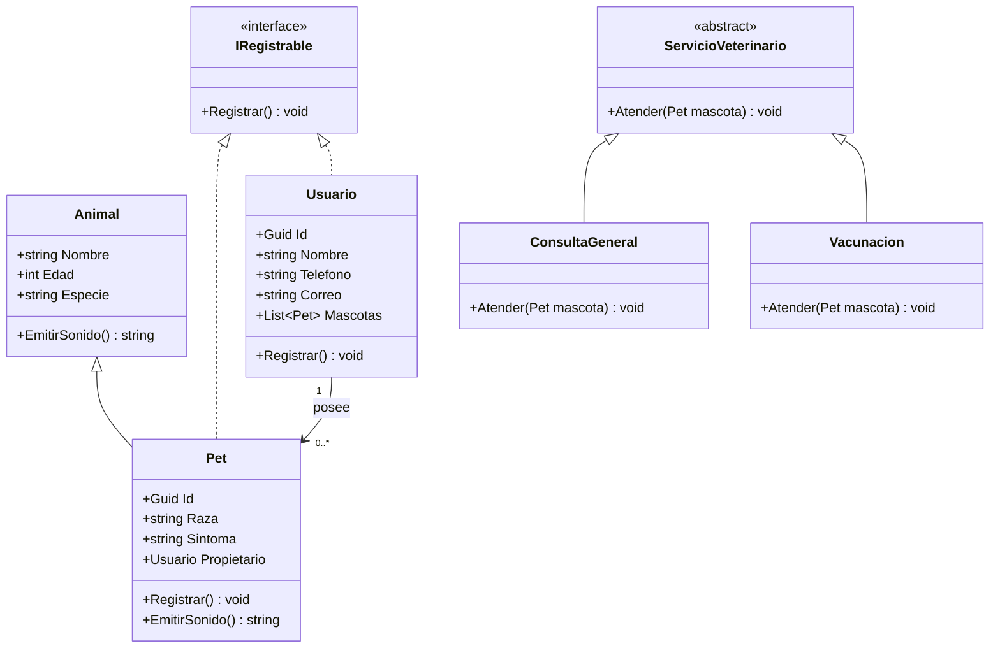

# UML - M5.3S3

## Modelo de clases

## Descripción

### Animal

Es la clase base del modelo. Contiene la información común de un animal:

- Nombre
- Edad
- Especie

También define `EmitirSonido()` como método virtual para permitir polimorfismo.

### Pet

Representa una mascota o paciente de la clínica.

Hereda de `Animal` y sobrescribe `EmitirSonido()` para producir un sonido dependiendo de la especie.

También implementa `IRegistrable`.

### Usuario

Representa al propietario de una o varias mascotas.

Mantiene una colección `List<Pet>` para representar la relación entre un propietario y sus mascotas.

También implementa `IRegistrable`.

### IRegistrable

Define el comportamiento `Registrar()` que deben implementar las clases registrables del sistema.

### ServicioVeterinario

Es una clase abstracta que define la operación `Atender(Pet mascota)`.

### ConsultaGeneral y Vacunacion

Son servicios veterinarios concretos que heredan de `ServicioVeterinario` y proporcionan su propia implementación de `Atender()`.

## Conceptos de POO utilizados

### Herencia

`Pet` hereda de `Animal`.

`ConsultaGeneral` y `Vacunacion` heredan de `ServicioVeterinario`.

### Polimorfismo

`Pet` sobrescribe `EmitirSonido()` definido en `Animal`.

Por ejemplo:

- Perro → Guau
- Gato → Miau
- Otra especie → Sonido genérico

### Abstracción

`ServicioVeterinario` es una clase abstracta que define el comportamiento común de los servicios veterinarios.

### Interfaces

`Pet` y `Usuario` implementan `IRegistrable`.

### Asociación

Un `Usuario` puede tener cero o muchas mascotas mediante `List<Pet>`.
